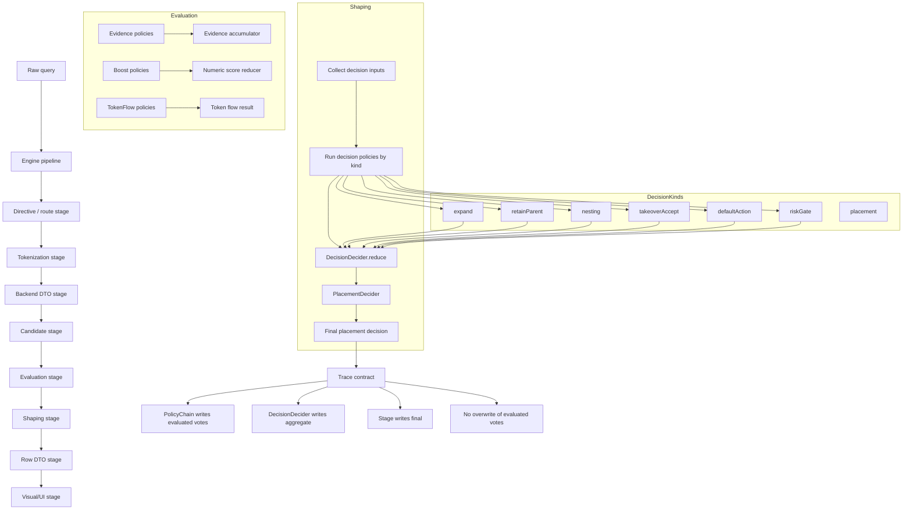

# Launcher policy decisions

## Purpose

Define the launcher decision pipeline contract: how policy votes are produced, reduced, and traced.

## Architecture



## Decision pipeline

```
Pipeline stage → decision kind → decider → policy votes → final decision
```

### Stages

1. **Evaluation** — evidence policies, boost policies, token flow (in `Evaluate.qml`)
2. **Shaping** — structural decisions: expand, retainParent, nesting, takeoverAccept, defaultAction, riskGate, placement (in `ResultShaping.qml`)
3. **Row DTO** — trace already-reduced decisions into row objects (`RenderedRows.qml`)

### Decision kinds

| Kind | Reducer | Source |
|---|---|---|
| `expand` | highest-priority | ExpandRetainPolicies + direct expand |
| `retainParent` | highest-priority | ExpandRetainPolicies |
| `nesting` | highest-priority | NestingPolicies |
| `takeover` | first-wins | TakeoverPolicies |
| `defaultAction` | first-wins | ExpandRetainPolicies |
| `riskGate` | first-wins | RiskGatePolicy |
| `evidence` | accumulate | Evidence policies |
| `boost` | best-wins | Boost policies |
| `tokenFlow` | first-wins | TokenFlowPolicies |

Structural kinds (expand, retainParent, nesting, takeoverAccept, defaultAction, riskGate) use `DecisionDecider.reduce(kind, votes, { mode })`.

Evidence and boost use `PolicyChain.run()` directly since they do not produce structural votes.

Token flow uses `PolicyChain.run(..., "first-wins")` — a documented exception.

## Policy vote shape

Structural policy votes are normalized by `PolicyChain.normalizePolicyResult()`:

```js
{
  decision: any,        // The policy's decision payload
  priority: number,     // From policy result or spec (0 = default)
  reasons: [
    { code: string, text: string, data?: object }
  ],
  policy: string,       // Policy name from spec
  kind: string           // Policy kind from spec
}
```

## Reducer rules

`DecisionDecider.reduce(kind, votes, options)`:

| Mode | Behavior |
|---|---|
| `highest-priority` | Select vote with highest `priority`. Same priority: tieBreak `"first"` (profile order) or `"last"`. Default for structural decisions. |
| `first-wins` | Select first non-null vote. Used for takeover and token flow. |
| `best-wins` | Numeric: highest `decision` value at same priority. Non-numeric: fallback to highest-priority. |
| `accumulate` | Return all votes as an array. Used for evidence. |
| `all-and` | Return `true` iff all votes have truthy `decision`. |
| `all-or` | Return `true` iff any vote has truthy `decision`. |

## Trace ownership

| Owner | Writes |
|---|---|
| `PolicyChain` (via tracePerPolicy callback) | Evaluated vote entries |
| `runDecisionPolicies()` | Aggregate trace via `DecisionTrace.aggregate()` |
| Stage (e.g., `ResultShaping`) | Final trace via `DecisionTrace.final()` |

Rules:
- Evaluated entries must not be overwritten by aggregate or final.
- `DecisionTrace.policy()` preserves `{ name, priority, enabled, returned, effect, reasons }`.
- `DecisionTrace.final()` writes both `value` and `decision` for compatibility.

## Exceptions

- **Evidence** policies return arrays; no vote wrapper.
- **Boost** policies return numbers; use `best-wins` directly.
- **Token flow** uses `first-wins` and returns raw flow objects with `reason`. Documented as intentionally non-conforming to structural vote shape.

## Examples

### expand decision (two policies + direct expand)

```js
Votes:
  { decision: { expand: true, maxChildren: 8 }, priority: 0,  policy: "expand-on-trailing-space", ... }
  { decision: { expand: true, includeAllChildren: true, ... }, priority: 100, policy: "implicit-direct-expand", ... }

Decider (highest-priority):
  → selected: { decision: { expand: true, includeAllChildren: true, ... }, priority: 100, ... }
```

### retainParent decision

```js
Votes:
  { decision: { retain: true },  priority: 0, policy: "retain-parent-when", ... }
  { decision: { retain: false }, priority: 80, policy: "retain-never", ... }

Decider (highest-priority):
  → selected: { decision: { retain: false }, priority: 80, ... }
```

## Non-goals

- Generic rule engine.
- UI-side scoring or decision computation.
- Raw QML objects in row DTOs.
- Colon-encoded policy specs.
- Duplicating decision model across docs files.
